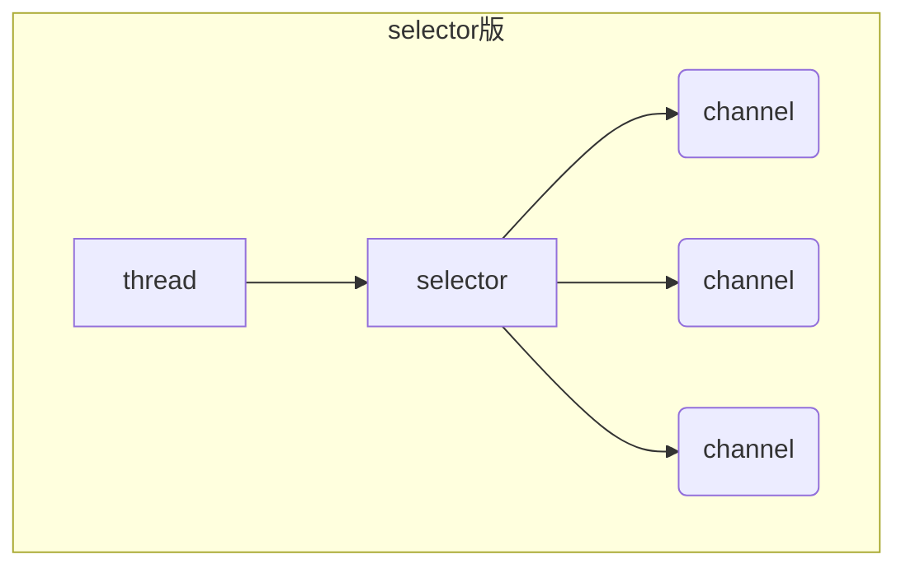

# NIO基础

## 1. 三大组件

### 1.1 Channel和Buffer

-   Channel：数据读写**双向通道**

-   Buffer：缓冲读写数据

-   ```mermaid
    graph LR
    channel --> buffer
    buffer --> channel
    ```

-   可以从channel写数据到buffer，也可以从buffer读数据到channel

-   常见channel：

    -   FileChannel：文件
    -   DatagramChannel：UDP
    -   SocketChannel：TCP
    -   ServerSocketChannel：TCP（Server专用）

-   常见Buffer：

    -   ByteBuffer（abstract）：
        -   MappedByteBuffer
        -   DirectByteBuffer
        -   HeapByteBuffer
    -   ShortBuffer、IntBuffer、......（不常用）

### 1.2 Selector

`selector` 的作用是配合一个`Thread`来管理多个 `channel`，获取这些 `channel` 上发生的事件，这些 `channel` 工作在非阻塞模式下，不会让`Thread`吊死在一个 `channel` 上。适合连接数特别多，但流量低的场景
调用`selector`的`slecet()`方法会阻塞直到`channel`发生读写就绪事件，发生后返回这些事件给`Thread`处理。




