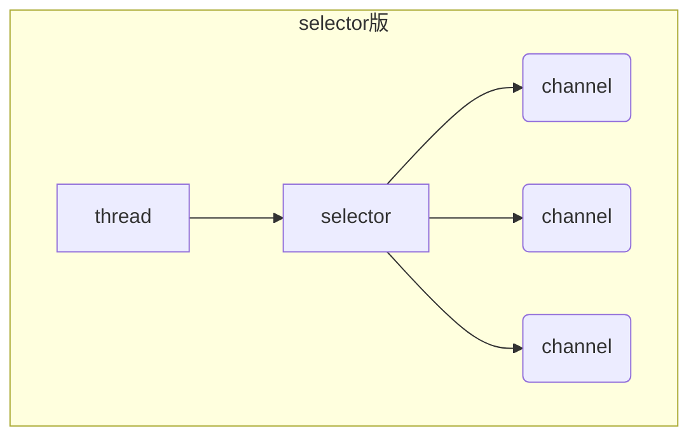
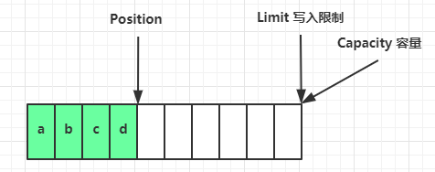

# NIO基础

## 1. 三大组件

### 1.1 Channel和Buffer

-   Channel：数据读写**双向通道**

-   Buffer：缓冲读写数据

-   ```mermaid
    graph LR
    channel --> buffer
    buffer --> channel
    ```

-   可以从channel写数据到buffer，也可以从buffer读数据到channel

-   常见channel：

    -   FileChannel：文件
    -   DatagramChannel：UDP
    -   SocketChannel：TCP
    -   ServerSocketChannel：TCP（Server专用）

-   常见Buffer：

    -   ByteBuffer（abstract）：
        -   MappedByteBuffer
        -   DirectByteBuffer
        -   HeapByteBuffer
    -   ShortBuffer、IntBuffer、......（不常用）

### 1.2 Selector

`selector` 的作用是配合一个`Thread`来管理多个 `channel`，获取这些 `channel` 上发生的事件，这些 `channel` 工作在非阻塞模式下，不会让`Thread`吊死在一个 `channel` 上。适合连接数特别多，但流量低的场景
调用`selector`的`selcet()`方法会阻塞直到`channel`发生读写就绪事件，发生后返回这些事件给`Thread`处理。



## 2. ByteBuffer

### 2.1 ByteBuffer常规使用

1. 向`buffer`写入数据，如调用`channel.read(buffer)`
2. 调用`filp()`切换至读模式
3. 从`buffer`读取数据，如调用`buffer.get()`
4. 调用`clear()`或`compact()`切换至写模式
5. 重复上述步骤

### 2.2 ByteBuffer结构

ByteBuffer重要属性：

- capacity
- position
- limit

1. 初始状态下

   
   
2. 处于写模式，position为写入位置，limit等于容量，在写入4个字节后

   

3. flip动作发生后，position切换为读取位置，limit切换为读取限制

   

4. 读取4个字节后，position=limit

   

5. clear动作发生后

   

6. compact方法，是将未读完的部分向前压缩，然后切换至写模式

   

### 2.3 ByteBuffer 常见方法

1. 分配空间： allocate

   ```java
   Bytebuffer buf = ByteBuffer.allocate(16);
   ```

2. 写入数据：channel.read, buffer.put

   ```java
   int readBytes = channel.read(buf)
   buf.put((byte)127)
   ```

3. 读取数据：channel.write, buffer.get

   ```java
   int writeBytes = channel.write(buf)
   byte b = buf.get(); // position 发生移动，使用rewind方法将position重新置0
   byte b = buf.get(i);// 获取索引i的内容，但不移动position
   ```

4. mark和reset

   mark 是在读取时，做一个标记，即使 position 改变，只要调用 reset 就能回到 mark 的位置

   > rewind 和 flip 都会清除 mark 位置

5. 分散读取

   ```java
   ByteBuffer a = ByteBuffer.allocate(3);
   ByteBuffer b = ByteBuffer.allocate(3);
   ByteBuffer c = ByteBuffer.allocate(5);
   channel.read(new ByteBuffer[]{a, b, c}); //将数据填充至a,b,c
   ```

6. 聚合写入

   ```java
   ByteBuffer d = ByteBuffer.allocate(4);
   ByteBuffer e = ByteBuffer.allocate(4);
   channel.write(new ByteBuffer[]{d, e});	//将d,e数据写入channel
   ```

   

### 2.4 黏包、半包

```java
public static void main(String[] args) {
    ByteBuffer source = ByteBuffer.allocate(32);
    source.put("Hello,world\nI'm zhangsan\nHo".getBytes());
    split(source);
    source.put("w are you?\nhaha!\n".getBytes());
    split(source);
}

private static void split(ByteBuffer source) {
    source.flip(); // 切换为读模式
    int oldLimit = source.limit(); //保护原始数据
    for (int i = 0; i < oldLimit; i++) { //执行flip后，position=0
        if (source.get(i) == '\n') { //get(i)逐个访问，但不移动position
            System.out.println(i);
            ByteBuffer target = ByteBuffer.allocate(i + 1 - source.position());
            // 0 ~ limit，设置长度
            source.limit(i + 1); //移动limit读取对应长度数据
            target.put(source); // 从source 读，向 target 写，此处移动position
            debugAll(target);
            source.limit(oldLimit);//还原limit，继续读入
        }
    }
    source.compact();
}
```

## 3. 文件编程

### 3.1 FileChannel

- 必须通过 FileInputStream、FileOutputStream 或者 RandomAccessFile 来获取 FileChannel，它们都有 getChannel 方法
- FileChannel 只能工作在阻塞模式下
- 通过 FileInputStream 获取的 channel 只能读
- 通过 FileOutputStream 获取的 channel 只能写
- 通过 RandomAccessFile 获取的 channel 是否能读写，根据构造 RandomAccessFile 时的读写模式决定

1. 读取

   从channel读取数据填充ByteBuffer，返回值表示读到的字节数，-1表示到达末尾

   ```java
   int readBytes = channel.read(buffer);
   ```

2. 写入

   ```java
   ByteBuffer buffer = ...;
   buffer.put(...); // 存入数据
   buffer.flip();   // 切换读模式
   
   while(buffer.hasRemaining()) {
       channel.write(buffer); //读出buffer内容，写入channel，所以 buffer为读模式
   }
   ```

   在 while 中调用 channel.write 是因为 write 方法并不能保证一次将 buffer 中的内容全部写入 channel

3. 关闭
   调用了 FileInputStream、FileOutputStream 或者 RandomAccessFile 的 close 方法会间接地调用 channel 的 close 方法

4. 位置

   ```java
   long pos = channel.position(); //获取当前位置
   
   long newPos = ...;
   channel.position(newPos); //设置位置
   ```

   设置当前位置时，如果设置为文件的末尾

   * 读取会返回 -1 
   * 写入会追加内容，但要注意如果 position 超过了文件末尾，再写入时在新内容和原末尾之间会有空洞（00）

5. 大小

   使用channel类的size方法获取文件大小

6. 强制写入

   操作系统出于性能的考虑，会将数据缓存，不是立刻写入磁盘。可以调用 force(true)  方法将文件内容和元数据（文件的权限等信息）立刻写入磁盘

### 3.2 Channel间传输

```java
//大文件传输，关键方法 transferTo
try (
	FileChannel from = new FileInputStream("data.txt").getChannel();
	FileChannel to = new FileOutputStream("to.txt").getChannel();
) {
	// 效率高，底层会利用操作系统的零拷贝进行优化
	long size = from.size();
	// left 变量代表还剩余多少字节
	for (long left = size; left > 0; ) {
	System.out.println("position:" + (size - left) + " left:" + left);
	left -= from.transferTo((size - left), left, to);
}
} catch (IOException e) {
	e.printStackTrace();
}
```

### 3.3 Path

- Path：表示文件路径
- Paths：工具类，获取path实例

```java
Path source = Paths.get("1.txt"); // 相对路径 使用 user.dir 环境变量来定位 1.txt
Path source = Paths.get("d:\\1.txt"); // 绝对路径 代表了  d:\1.txt
Path source = Paths.get("d:/1.txt"); // 绝对路径 同样代表了  d:\1.txt
Path projects = Paths.get("d:\\data", "projects"); // 代表了  d:\data\projects
```

### 3.4 Files

```java
//1. 检查文件是否存在
Path path = Paths.get("helloword/data.txt");
System.out.println(Files.exists(path));
//2. 创建一级目录
Path path = Paths.get("helloword/d1");
Files.createDirectory(path);
//如果目录已存在，会抛异常 FileAlreadyExistsException
//不能一次创建多级目录，否则会抛异常 NoSuchFileException
//3. 创建多级目录 
Path path = Paths.get("helloword/d1/d2");
Files.createDirectories(path);
//4. 拷贝文件
Path source = Paths.get("helloword/data.txt");
Path target = Paths.get("helloword/target.txt");
Files.copy(source, target); 
//如果文件已存在，会抛异常 FileAlreadyExistsException
//如果希望用 source 覆盖掉 target，需要用 StandardCopyOption 来控制
Files.copy(source, target, StandardCopyOption.REPLACE_EXISTING);
//5. 移动文件
Path source = Paths.get("helloword/data.txt");
Path target = Paths.get("helloword/data.txt");
Files.move(source, target, StandardCopyOption.ATOMIC_MOVE);
//StandardCopyOption.ATOMIC_MOVE 保证文件移动的原子性

Path target = Paths.get("helloword/target.txt");
Files.delete(target);
//如果文件不存在，会抛异常 NoSuchFileException


```

